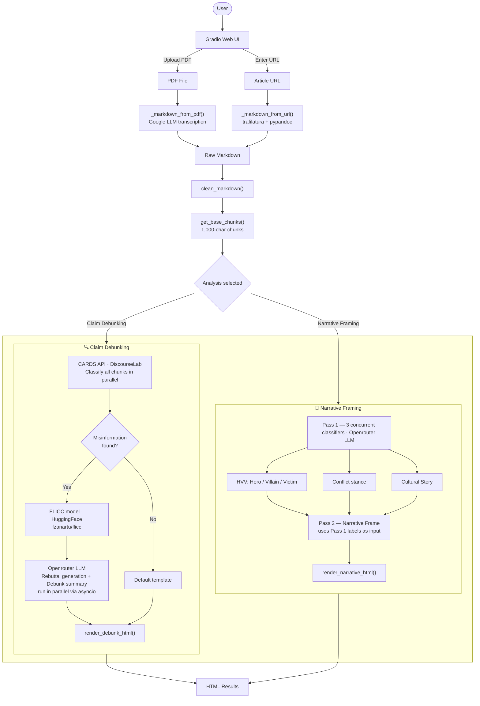

# Fighting Harmful Online Communication

## Supporting Climate Journalism in Australia: An AI-based tool to detect and counter climate misinformation

The project "Supporting Climate Journalism in Australia: An AI-based tool to detect and counter climate misinformation" is part of a University of Melbourne Hallmark Research Initiative on "Fighting Harmful Online Communication". This project aims to combat this issue through designing an AI model that identifies and corrects problematic climate content in long written and oral text. The goal is to support journalists sift through their sources, e.g. governmental reports, scientific articles, podcast episodes, and recognize climate-related misinformation, biased frames, or false balance.




### Directory Structure

```md
FHOC/
├── README.md                    # Project overview and instructions
├── CHANGELOG.md
├── .gitignore
├── .python-version
├── pyproject.toml               # Project configuration
├── requirements.txt
├── packages.txt
├── uv.lock
├── main.py                      # Gradio app entry point
├── src/                         # Source code
│   ├── __init__.py
│   ├── api/                     # API handlers
│   │   ├── __init__.py
│   │   ├── apis.py
│   │   ├── cards.py             # CARDS classification API
│   │   ├── debunk.py            # Claim debunking pipeline
│   │   ├── debunk_summary.py
│   │   ├── narrative.py         # Narrative framing pipeline
│   │   └── rebuttal.py
│   ├── llm/                     # LLM client wrappers
│   │   ├── __init__.py
│   │   └── llms.py
│   ├── prompts/                 # Prompt templates
│   │   ├── __init__.py
│   │   ├── cards.md
│   │   ├── layer_1.md
│   │   ├── layer_2.md
│   │   ├── layer_3.md
│   │   ├── layer_4.md
│   │   └── md_transcript.md
│   └── utils/                   # Utility functions
│       ├── __init__.py
│       ├── chunking.py          # Text chunking utilities
│       ├── custom.css           # Gradio custom styles
│       └── parser_utils.py      # Text parsing utilities
├── data/
│   ├── raw/                     # Original PDF source files
│   ├── md/                      # Converted markdown versions
│   └── json/                    # Processed JSON outputs
└── notebooks/                   # Jupyter exploration notebooks
```